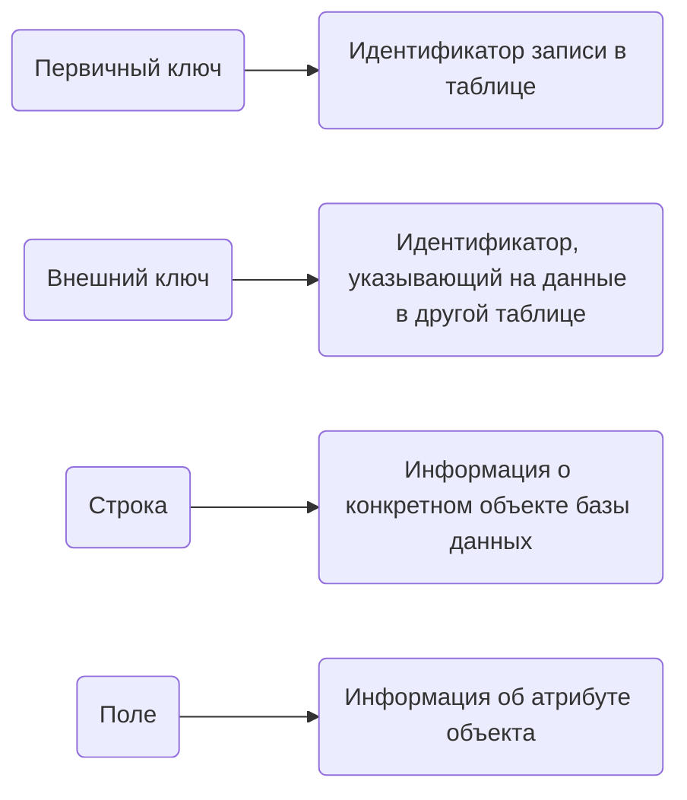

### Вопрос 01/04

**Какую ошибку в нижеприведённых таблицах вы видите?**

**Ответ:**
Идентификаторов предметов не должно быть в таблице экзаменов

-----------------------------------------------------------------

### Вопрос 02/04

**Верно ли утверждение: В базе данных может храниться только текстовая информация?**

**Ответ:**
Неверно

________________________________________________________________________

### Вопрос 03/04

**Сопоставьте определения с соответствующими терминами**

**Ответ:**

_________________________________________________________________________________
### Вопрос 04/04

**Сколько внешних ключей содержится в таблице Exams?**

**Ответ:**
2
____________________________________________________________________________
