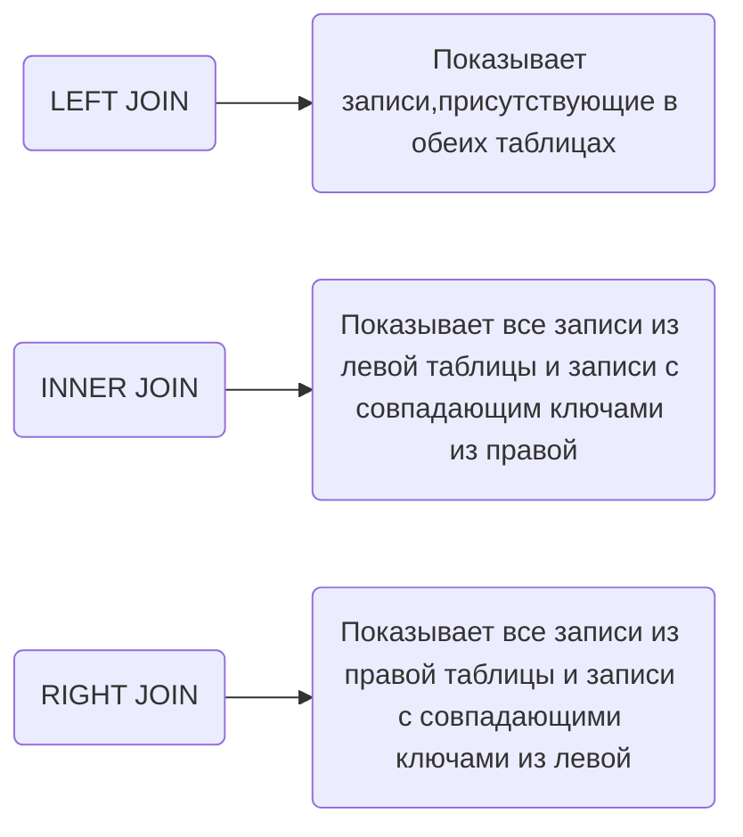

### Вопрос 01/04

Сопоставьте JOIN'ы с их определениями

**Ответ:**

___________________________________________________________________________________

### Вопрос 02/04

При использовании LEFT JOIN и отсутствии совпадающих записей в правой таблице - что будет показано на месте отсутствующих записей?

**Ответ:**

Показываются значения NULL в соответствующих ячейках

_______________________________________________________________________________
### Вопрос 03/04

HAVING и WHERE

**Ответ:**

Могут использоваться в одном запросе, если есть GROUP BY

_________________________________________________________________________

### Вопрос 04/04

Выберите функцию для объединения строк

**Ответ:**

CONCAT